# ShopNest

**DBS302 Final Project** - an e-commerce platform built on MongoDB and Redis.
[Live demo](https://drive.google.com/drive/folders/1rskqpJfuJJCUou046TyFXROjLsBVP6Df?usp=sharing)
---

## Architecture Overview

ShopNest uses two databases for two different jobs:

- **MongoDB** (3-node replica set) is the source of truth - products, orders, users, categories, reviews, and inventory.
- **Redis** (1 master + 2 replicas + 3 sentinels) is the fast in-memory layer - sessions, carts, trending leaderboards, rate limiting, and unique-visitor counts.

An Express backend serves the REST API (with Swagger docs). A Next.js frontend uses every feature. Orders are placed inside a MongoDB ACID transaction, and product pages use a Redis cache-aside pattern with a lock to stop cache stampedes.

---

## Prerequisites

- [Docker Desktop](https://www.docker.com/products/docker-desktop) (Engine 24+, Compose v2)
- [Node.js 20+](https://nodejs.org/) — only if running k6 or the seed outside Docker
- [k6](https://k6.io/docs/get-started/installation/) — only for load tests

---

## Setup & Running

**1. Clone and enter the project**
```bash
git clone https://github.com/tandinomu/DBS302_Assignment.git
cd DBS302_Assignment/shopnest
```

**2. Create the env file**
```bash
cp .env.example .env   # defaults work for local Docker
```

**3. Generate the MongoDB keyfile** (if `docker/mongo-keyfile` is missing)
```bash
openssl rand -base64 756 > docker/mongo-keyfile
chmod 400 docker/mongo-keyfile
```

**4. Start everything**
```bash
docker-compose up --build
```
This launches 3 MongoDB nodes, the replica-set init container, Redis (master + 2 replicas + 3 sentinels), the backend, and the frontend. First boot takes about 60 seconds — `mongo-init` runs `rs.initiate()` and waits for the election, and Next.js builds.

> **Note on ports:** the backend container listens on `5000`, but Compose maps it to **`5001`** on your machine. Use `localhost:5001` from the browser/host.

**5. Seed the database** (once the backend is healthy)
```bash
docker exec shopnest-backend node scripts/seed.js
```
This creates:
- 10 users (1 admin, 2 sellers, 7 customers) — password `Password123!`
- 5 categories + 10 subcategories
- 50 products with variants and inventory records
- 20 orders with mixed statuses
- ~80 reviews
- Redis: trending set, HyperLogLog counters, recently-viewed lists, leaderboards

**6. Open the app**

| Service | URL |
|---------|-----|
| Frontend | http://localhost:3000 |
| Backend API | http://localhost:5001 |
| Swagger Docs | http://localhost:5001/api-docs |
| Health Check | http://localhost:5001/health |

**Test logins** (all use `Password123!`):
- Admin — `admin@shopnest.com`
- Seller — `alice@shopnest.com`
- Customer — `carol@shopnest.com`

---

## API Reference

### Auth
| Method | Path | Auth | Description |
|--------|------|------|-------------|
| POST | `/auth/register` | No | Register, get a JWT |
| POST | `/auth/login` | No | Login (rate limited 5/min), creates a Redis session |
| POST | `/auth/logout` | JWT | Logout, deletes the Redis session |

### Products
| Method | Path | Auth | Description |
|--------|------|------|-------------|
| GET | `/products` | No | List with filters (category, price, sort, paging) |
| GET | `/products/search?q=` | No | Full-text search (MongoDB text index) |
| GET | `/products/:id` | No | Cache-aside read; `X-Cache` header shows HIT/MISS |
| POST | `/products` | Seller/Admin | Create (Mixed attributes for polymorphic data) |
| PUT | `/products/:id` | Seller/Admin | Update + invalidate cache |
| DELETE | `/products/:id` | Seller/Admin | Delete + invalidate cache |

### Categories
| Method | Path | Auth | Description |
|--------|------|------|-------------|
| GET | `/categories` | No | List categories (filter by `?parent=`) |

### Cart (Redis Hash)
| Method | Path | Auth | Description |
|--------|------|------|-------------|
| GET | `/cart` | Optional | `HGETALL cart:{userId}` or guest cart |
| POST | `/cart/add` | Optional | `HSET` field `{productId}:{sku}` |
| PUT | `/cart/update` | Optional | `HSET` new quantity |
| DELETE | `/cart/item` | Optional | `HDEL` one field |
| DELETE | `/cart` | Optional | `DEL` whole cart |
| POST | `/cart/merge` | JWT | Merge guest cart into user cart on login |

### Orders
| Method | Path | Auth | Description |
|--------|------|------|-------------|
| POST | `/orders` | JWT | Place order — ACID transaction (rate limited 3/min) |
| GET | `/orders` | JWT | My order history (`{ user, placedAt }` index) |
| GET | `/orders/:id` | JWT | One order |
| GET | `/orders/all` | Admin | All orders across users |
| PUT | `/orders/:id/status` | Admin/Seller | Update status |

### Users
| Method | Path | Auth | Description |
|--------|------|------|-------------|
| GET | `/users/me` | JWT | Profile with embedded addresses |
| PUT | `/users/me` | JWT | Update profile |
| POST | `/users/me/addresses` | JWT | Add an address |
| GET | `/users/me/wishlist` | JWT | Wishlist with product details |
| POST | `/users/me/wishlist/:productId` | JWT | Add to wishlist |
| DELETE | `/users/me/wishlist/:productId` | JWT | Remove from wishlist |

### Analytics
| Method | Path | Auth | Description |
|--------|------|------|-------------|
| GET | `/analytics/sales` | Admin | Sales report (`$group` pipeline) |
| GET | `/analytics/top-products` | Admin | Top sellers (`$unwind` + `$group`) |
| GET | `/analytics/low-stock` | Admin | Low stock (`$lookup` + `$match`) |
| GET | `/analytics/views-vs-purchases` | Admin | Conversion rates |
| GET | `/analytics/trending` | No | Trending (Redis `ZREVRANGE`) |
| GET | `/analytics/leaderboard/sellers` | No | Seller leaderboard (sorted set) |
| GET | `/analytics/leaderboard/buyers` | No | Buyer leaderboard (sorted set) |
| GET | `/analytics/unique-visitors/:id` | No | Unique visitors (`PFCOUNT`) |
| GET | `/analytics/cache-stats` | Admin | Redis hit ratio, memory, clients |

---

## Running k6 Load Tests

General load test (ramps to 100 VUs):
```bash
k6 run --env BASE_URL=http://localhost:5001 backend/k6/load-test.js
```

Cache benchmark (HIT vs MISS latency):
```bash
docker exec shopnest-redis-master redis-cli FLUSHALL   # cold cache
k6 run --env BASE_URL=http://localhost:5001 backend/k6/benchmark-cache.js
```
Measured result: **99.9% hit rate**, HIT p95 **12 ms** vs MISS p95 **65 ms** (5.4× faster). See `report.md` §6 for the full run.

---

## Project Structure

```
shopnest/
├── backend/
│   ├── src/
│   │   ├── config/        db.js, redis.js
│   │   ├── models/        User, Product, Order, Category, Review, Inventory
│   │   ├── routes/        auth, products, categories, cart, orders, users, analytics
│   │   ├── controllers/   one per route group
│   │   ├── middleware/    auth.js, rateLimiter.js, cacheMiddleware.js
│   │   ├── services/      cacheService.js, sessionService.js, leaderboardService.js
│   │   ├── aggregations/  salesReport, topProducts, lowStock, viewsVsPurchases
│   │   └── app.js
│   ├── scripts/seed.js
│   └── k6/                load-test.js, benchmark-cache.js
├── frontend/
│   ├── pages/             index, products/[id], cart, checkout, login, register, dashboard, ...
│   └── components/        Navbar, ProductCard, CartItem, Leaderboard
├── docker/
│   ├── redis.conf         RDB + AOF, allkeys-lru, 256MB maxmemory
│   └── mongo-keyfile      Replica-set internal auth
├── docker-compose.yml     12-service orchestration
├── report.md              Technical report (DBS302)
└── README.md
```

---

## MongoDB Concepts Used

| Concept | Where |
|---------|-------|
| Replica set (3 nodes) | `docker-compose.yml` + `config/db.js` |
| ACID multi-doc transaction | `controllers/orderController.js` → `placeOrder()` |
| Aggregation pipelines | `aggregations/*.js` |
| Embedding vs referencing | `models/User.js`, `Order.js`, `Review.js` |
| `Schema.Types.Mixed` | `models/Product.js` → `attributes` |
| Indexes (14 total: 8 compound, 1 text, 5 single) | all model files, with comments |
| Write/read concern `majority` | `config/db.js` + transaction options |
| Snapshot pattern | `models/Order.js` → `nameSnapshot`, `priceSnapshot` |

## Redis Concepts Used

| Concept | Key Pattern | Where |
|---------|-------------|-------|
| String (rate limit) | `ratelimit:{ip}:{endpoint}` | `middleware/rateLimiter.js` |
| Hash (session) | `session:{userId}` | `services/cacheService.js` |
| Hash (cart) | `cart:{userId}` | `services/cacheService.js` |
| List (recently viewed) | `recent:{userId}` | `services/cacheService.js` |
| Sorted Set (trending) | `trending:products` | `services/cacheService.js` |
| Sorted Set (leaderboard) | `leaderboard:sellers:{month}` | `services/cacheService.js` |
| HyperLogLog | `hll:product:{id}:views` | `services/cacheService.js` |
| Distributed lock | `lock:product:{id}` | `middleware/cacheMiddleware.js` |
| Cache-aside + stampede guard | product caching | `middleware/cacheMiddleware.js` |
| Jittered TTL | all cache keys | `services/cacheService.js` |
| Sentinel HA | — | `config/redis.js` |
| RDB + AOF persistence | — | `docker/redis.conf` |

---

## Screenshots

### Frontend

#### Homepage
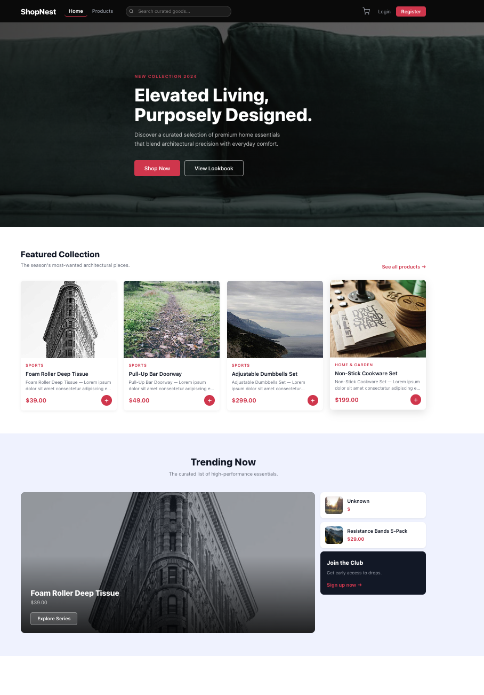

#### Product Detail (Redis CACHED badge visible)
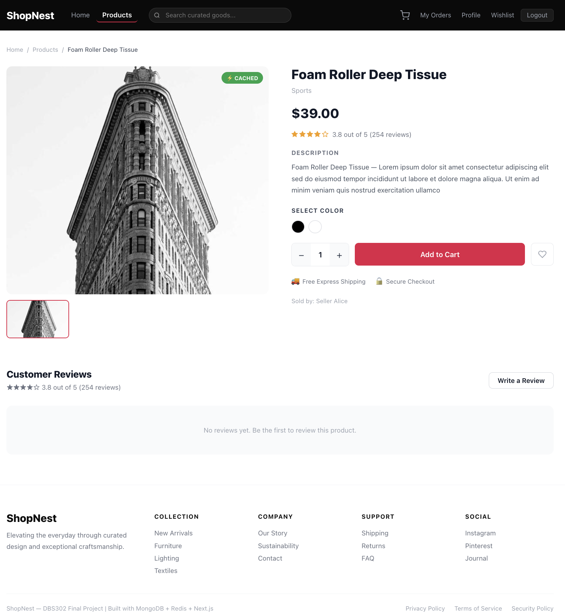

#### Shopping Cart
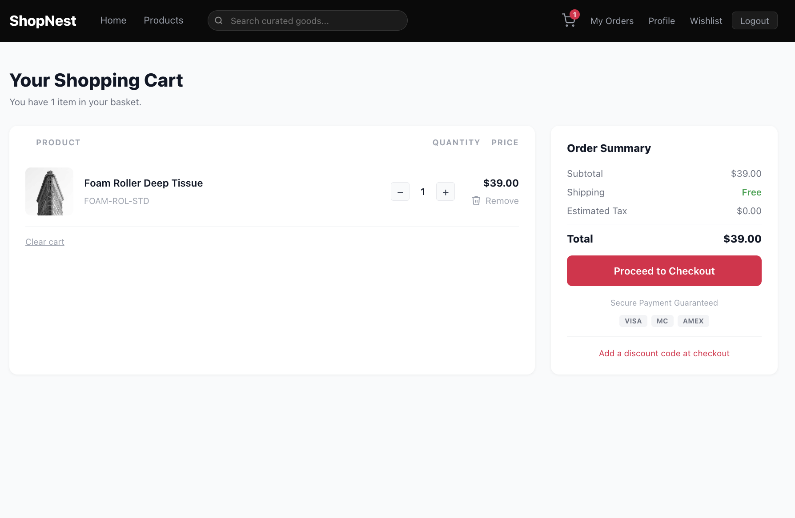

#### My Orders
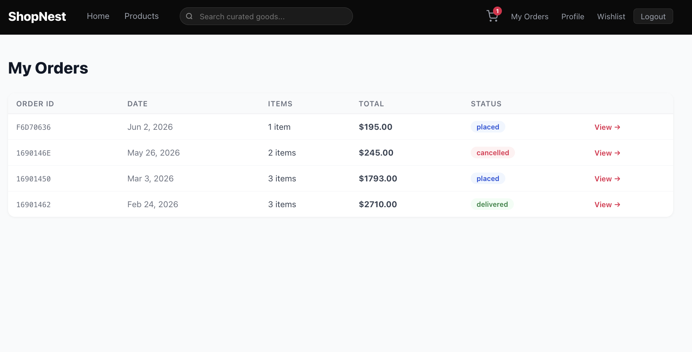

#### Admin Dashboard
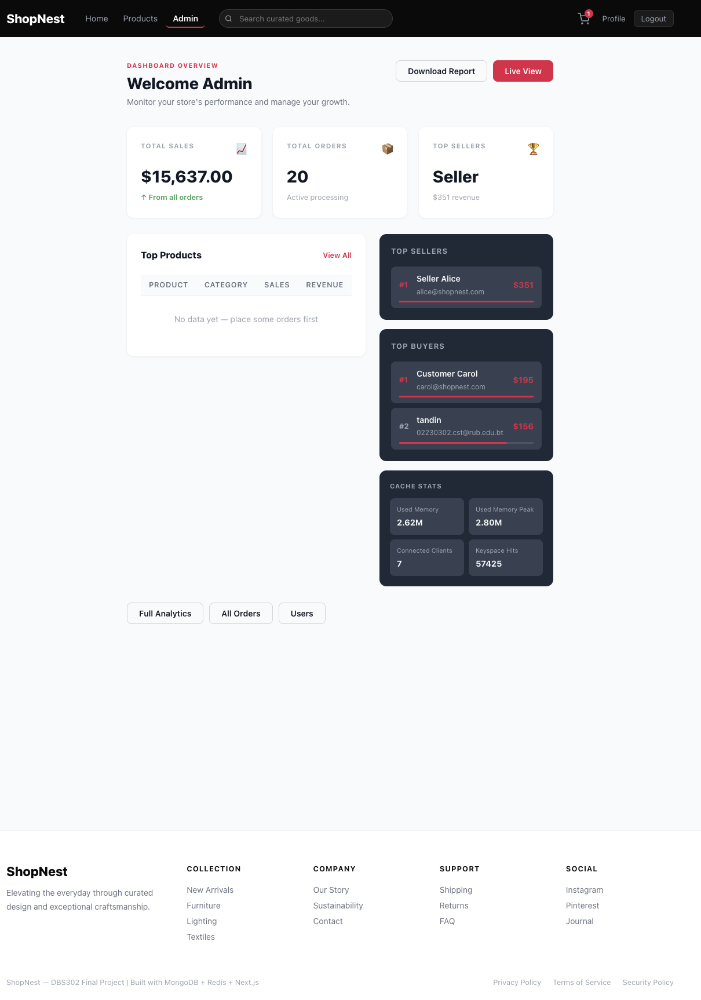

#### Order Management
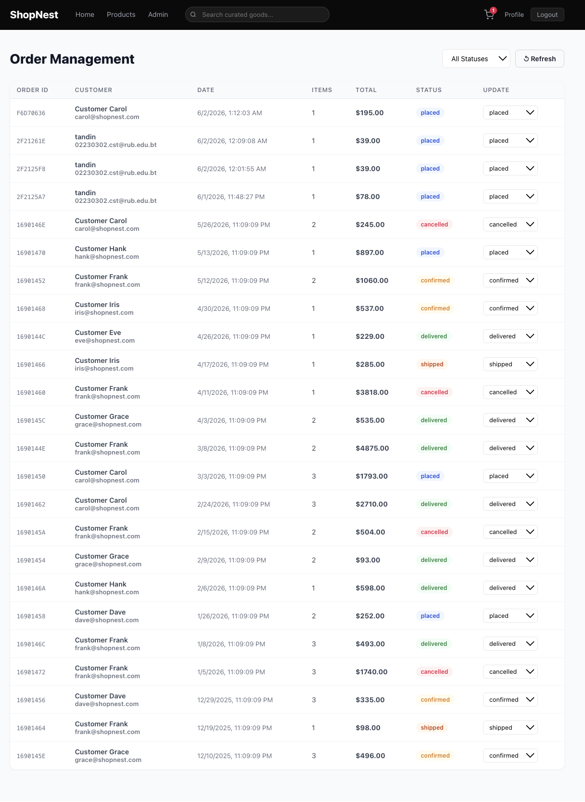

#### Analytics — Sales Report (MongoDB Aggregation Pipeline)
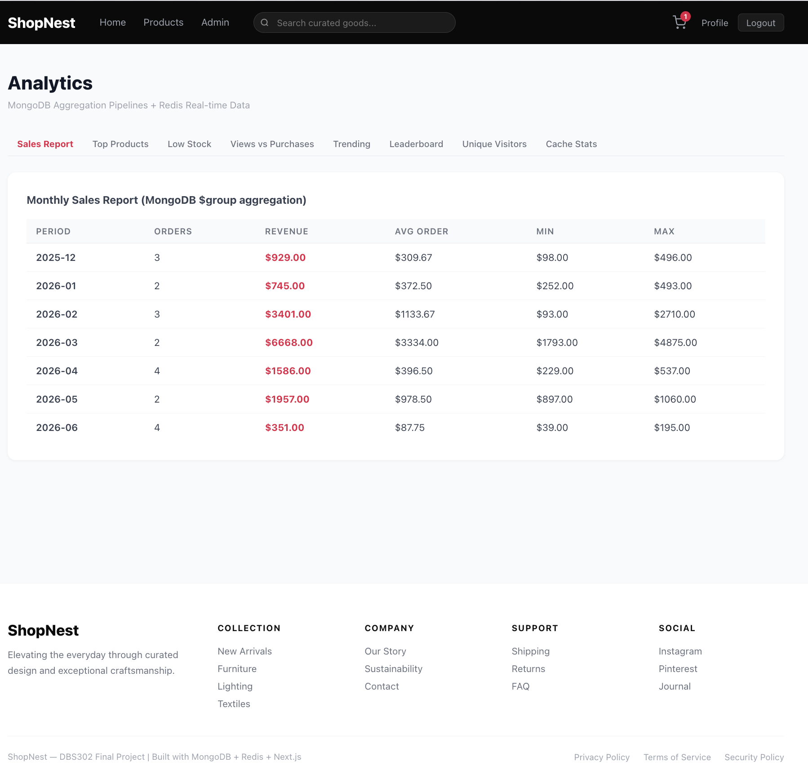

#### Analytics — Trending Products (Redis Sorted Set)
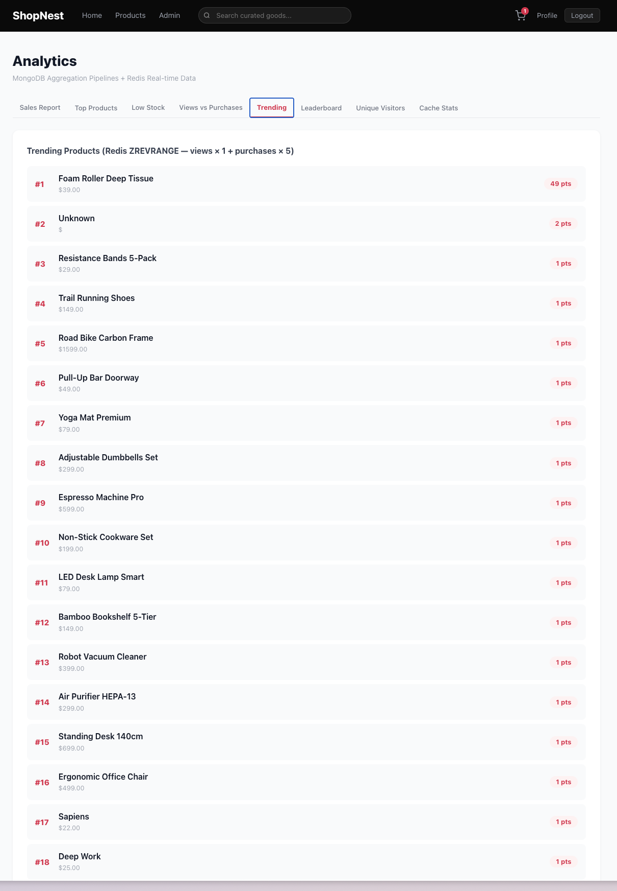

#### Analytics — Leaderboard (Redis Sorted Set)
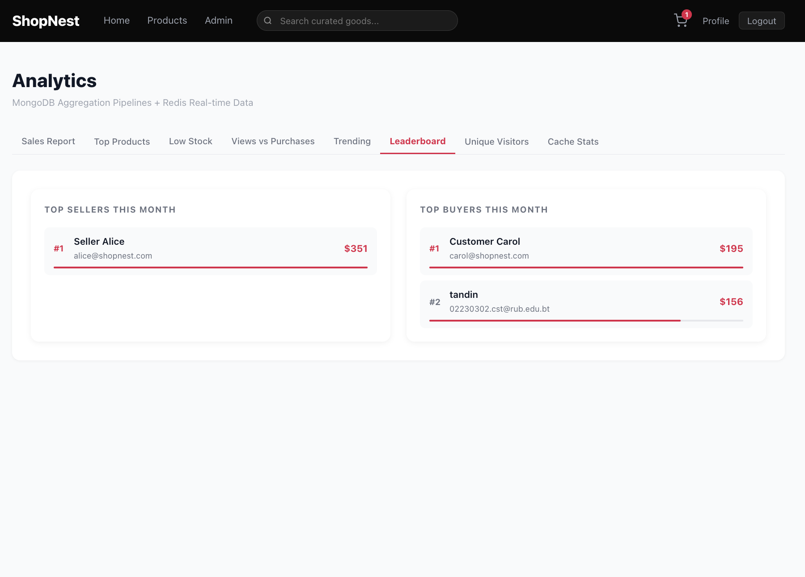

#### Analytics — Cache Statistics (Redis INFO)
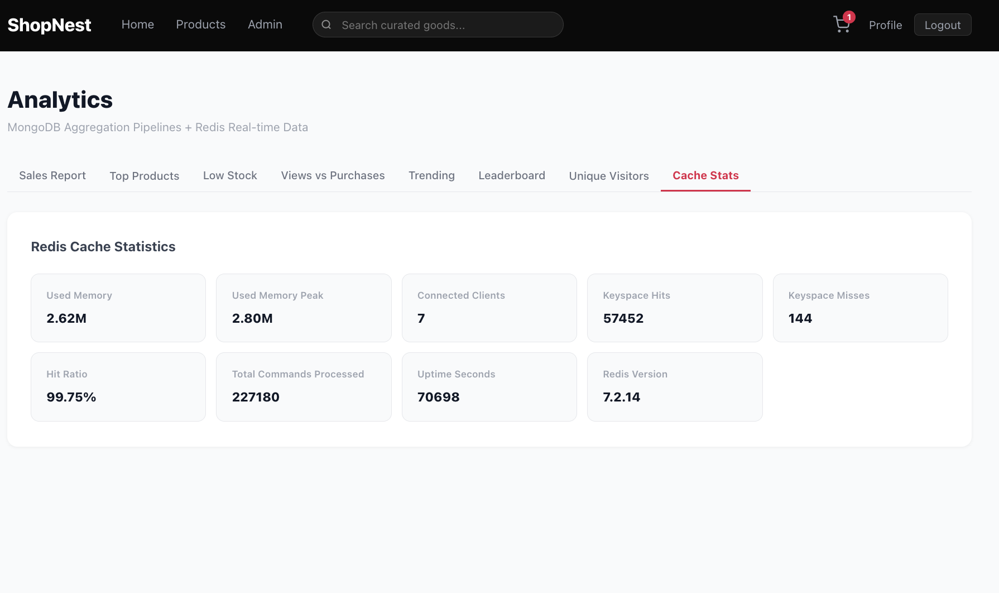

### Backend Infrastructure

#### Swagger API Documentation
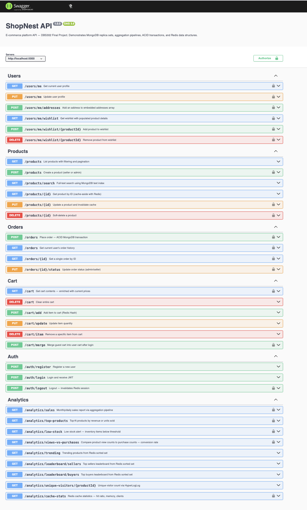

#### Health Check (MongoDB + Redis Connected)
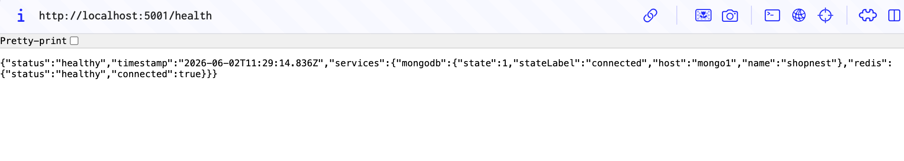

#### Docker Containers (All 11 Running Healthy)
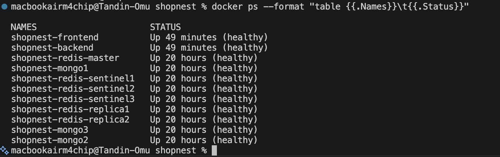

#### MongoDB Replica Set (1 PRIMARY + 2 SECONDARY)
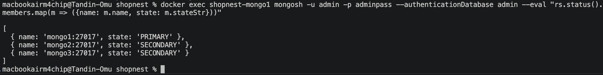

#### Redis Sentinel (Master + 2 Replicas + 3 Sentinels)
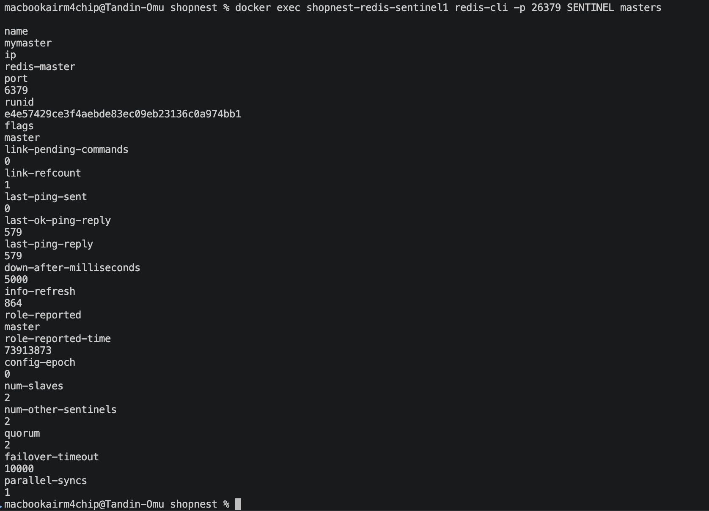

#### Redis Cache Keys (Products Cached)
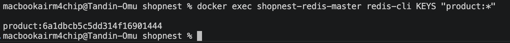
